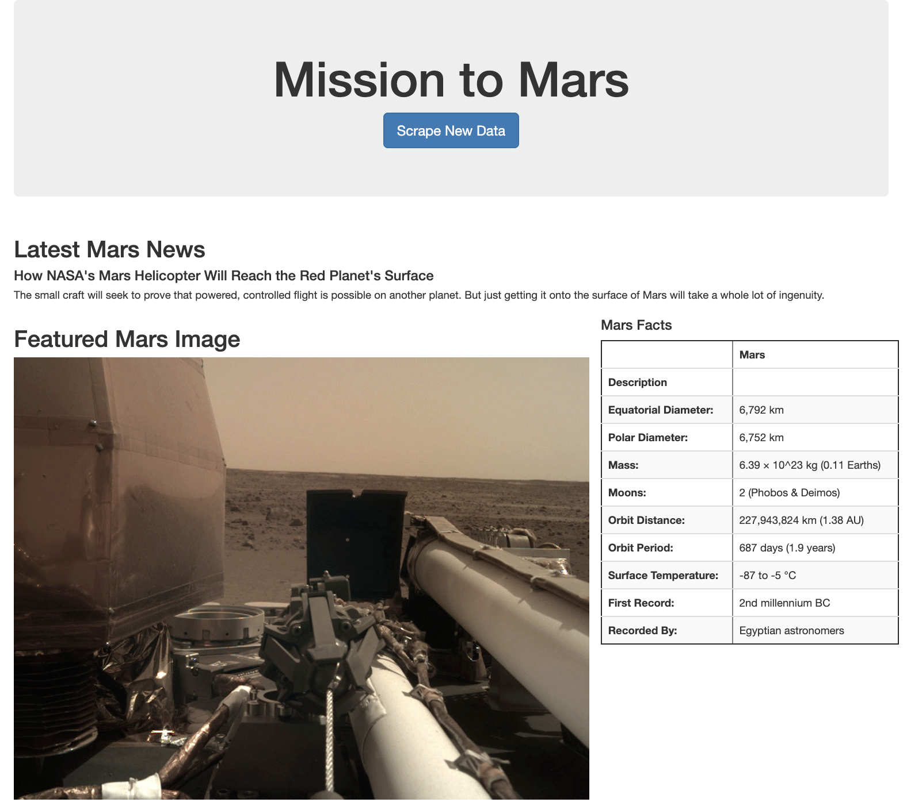

# Web Scraping - Mission to Mars

In this assignment, you will build a web application that scrapes various websites for data related to the Mission to Mars and displays the information in a single HTML page. The following outlines what you need to do.

## Step 1 - Scraping

Initial scraping done using Jupyter Notebook, BeautifulSoup, Pandas, and Requests/Splinter.

### NASA Mars News

* Scraped the [NASA Mars News Site](https://mars.nasa.gov/news/) and collected the latest News Title and Paragraph Text. Assigned the text to variables that can be referenced later.

### JPL Mars Space Images - Featured Image

* Visited the url for JPL Featured Space Image [here](https://www.jpl.nasa.gov/spaceimages/?search=&category=Mars).

* Used splinter to navigate the site and found the image url for the current Featured Mars Image and assigned the url string to a variable called `featured_image_url`.

### Mars Facts

* Visited the Mars Facts webpage [here](https://space-facts.com/mars/) and used Pandas to scrape the table containing facts about the planet including Diameter, Mass, etc.

* Used Pandas to convert the data to a HTML table string.

### Mars Hemispheres

* Visited the USGS Astrogeology site [here](https://astrogeology.usgs.gov/search/results?q=hemisphere+enhanced&k1=target&v1=Mars) to obtain high resolution images for each of Mar's hemispheres.

* Had to click each of the links to the hemispheres in order to find the image url to the full resolution image.

* Save both the image url string for the full resolution hemisphere image, and the Hemisphere title containing the hemisphere name. Using a Python dictionary, store the data using the keys `img_url` and `title`.

* Appended the dictionary with the image url string and the hemisphere title to a list. This list will contain one dictionary for each hemisphere.

## Step 2 - MongoDB and Flask Application

Using MongoDB with Flask template created a new HTML page that displays all of the information that was scraped from the URLs above.

* Started by converting the Jupyter notebook into a Python script called `scrape_mars.py` with a function called `scrape` that executes all of the scraping code from above and return one Python dictionary containing all of the scraped data.

* Next, a route called `/scrape` was created that will import the `scrape_mars.py` script and call the `scrape` function.

  * Stored the return value in Mongo as a Python dictionary.

* Created a root route `/` that will query the Mongo database and pass the mars data into an HTML template to display the data.

* Created a template HTML file called `index.html` that takes the mars data dictionary and displays all of the data in the appropriate HTML elements. 

